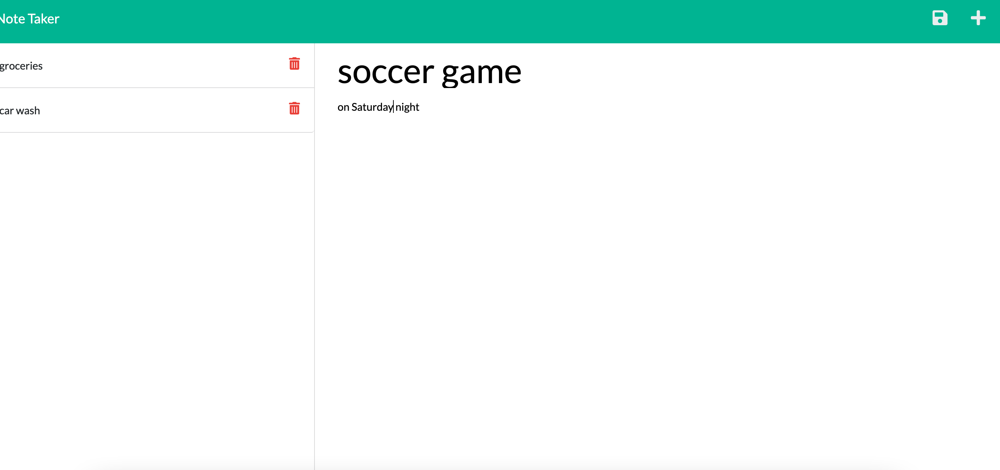

# Note-Taker  
[](https://opensource.org/licenses/Artistic-2.0)

## Description
An application to write and save notes using Express.js back end which retrieve note data from a JSON file. Enter a title and description for each note on the right column and save it to the right column.  You can click on each saved notes to review them and also delete them if necessary.


[click here](sample-readme/sampleReadme.md)

## Table of Contents

* [Deployment](#deployment)
* [Demo](#demo)
* [Usage](#usage)
* [License](#license)
* [Contribution](#contribution)
* [Questions](#questions)


## Deployment

click here:

Link: https://note-taker-for-beginners.herokuapp.com/


## Demo

 "type a note"
 "add a note"
 "review a note"
 "write a new note"
 "delete a note"


## Usage

You can use this application to save notes for upcoming events and modify them as needed.
 
## License

[](https://opensource.org/licenses/MIT)


## contribution

Please send me an email if you can want to contribute or submit any suggestions: walterlaw19@gmail.com


## Questions

If you have any questions or concerns, you can reach me at: walterlaw19@gmail.com

or visit my GitHub: https://github.com/walterlaw19


```
Made by by Walter G
```

---
##### © 2021 WG.


